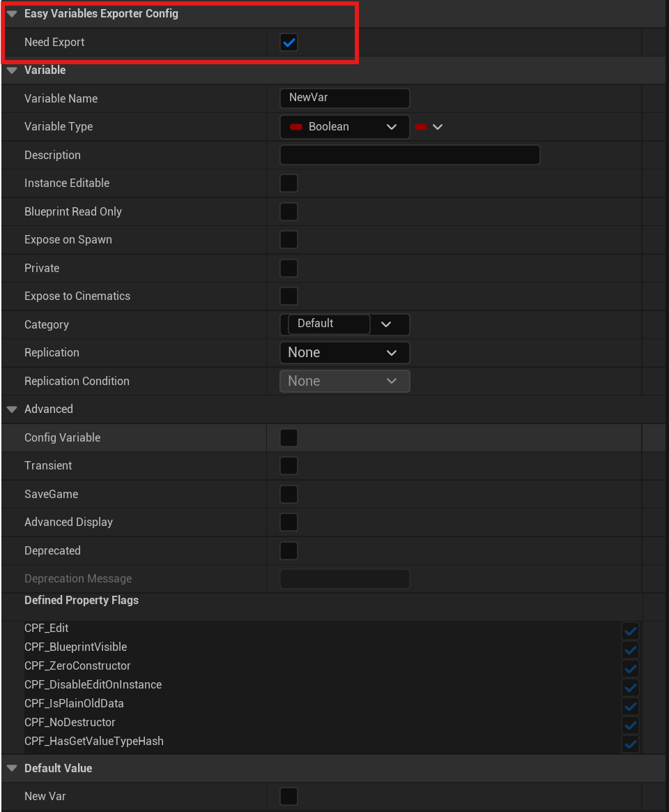
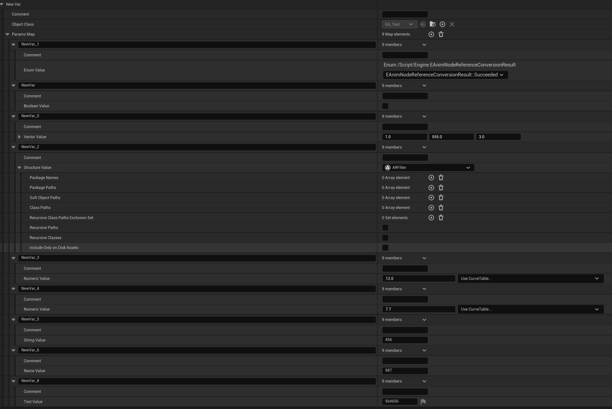

# EasyVariablesExporter

## 概述

为了解决参数变量散落在各个蓝图中不便于配置的问题，制作了一个可以把蓝图变量导出的插件，使用时可以把蓝图变量导出至DataTable，并通过重载TableRowBase的OnDataTableChanged函数实现改动DataTable时自动将改动导入到蓝图，无需每次都进入蓝图修改，便于配置。

## 使用方法
1. 只需要把需要导出的变量的NeedExport属性打勾，然后即可通过函数自动导出导入
<p align = "center">
   
   </p>

2. 使用函数库函数导入导出

```
UEasyVariablesExporterFuncLib::ExportParamFromObject
UEasyVariablesExporterFuncLib::ImportParamToObject
```

目前支持导出的变量类型为：
1. Int、Float
2. String
3. FText
4. FName
5. Structure
6. ENumerate

导出后格式如下
<p align = "center">
   
   </p>